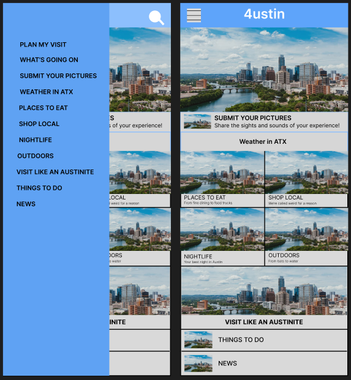

<h1>4ustin - Your Ultimate Austin Guide</h1>

  4ustin is a dynamic application that's currently in development, aimed at providing a comprehensive and up-to-date experience for both visitors and newcomers to Austin. As someone frequently approached for recommendations on experiencing the best of Austin, I recognized the need for a centralized solution. To address this, I conceptualized and am currently developing 4ustin—a one-stop app that eliminates the hassle of scouring Google or Yelp for Austin's attractions.

<h3>Key Features:</h3>
<ul>
  <li>
    <bold>Curated Local Insights:</bold> 4ustin offers a curated collection of local hotspots, ranging from charming restaurants and unique shops to vibrant nightlife and captivating outdoor destinations. Users can trust that they're accessing the latest information about Austin's gems.
  </li>
</ul>

  
  

